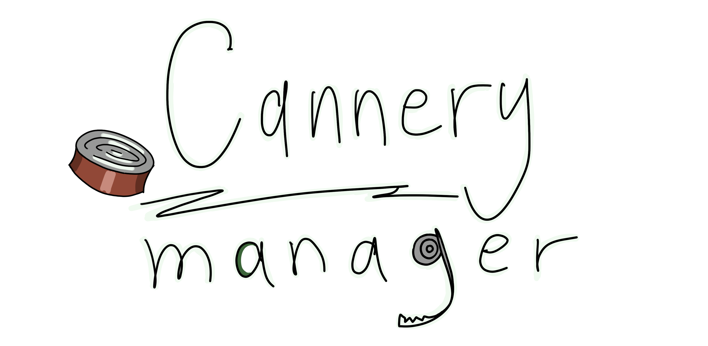
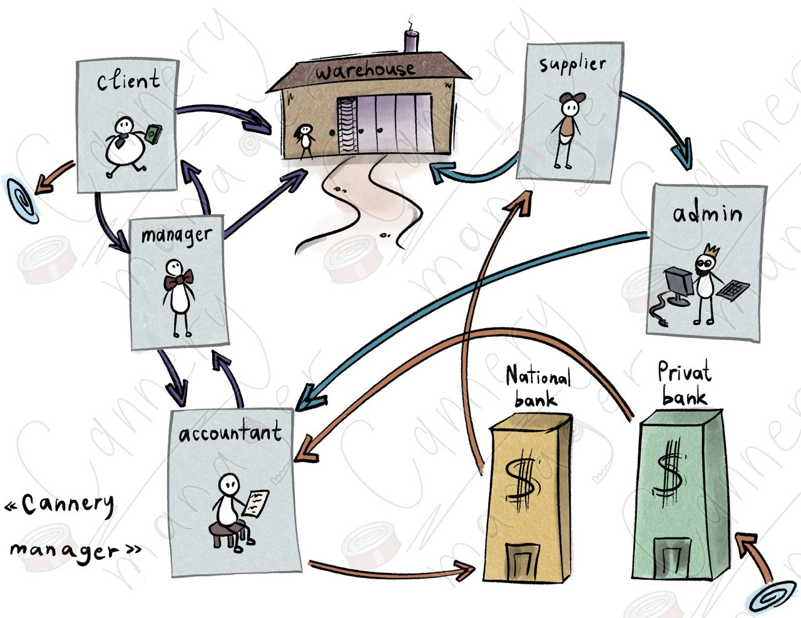
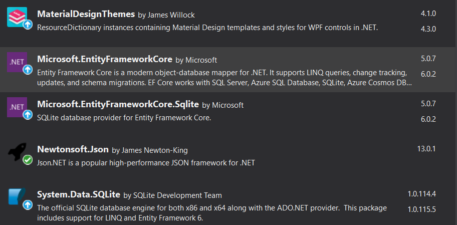

# 

<b>Cannery Manager</b> (rus. «Консервный менеджер») is a tool created for managing the work of a warehouse, strictly for ukrainian users and non-commersial purposes, by students of the <i>Odesa Mechnikov National University</i> for their Summer Practice.

## General Information

The main goal of the work is to keep up-to-date records of goods in the warehouse and their price. We enter all goods in the warehouse, and then we can perform basic functions to update it:

- register the purchase of a particular product in any currency, register the purchase of several goods at once with the calculation of the price in the selected currency.
- conduct a revaluation of goods in the warehouse, taking into account current exchange rate.
- add, delete or edit products

It should also be possible to see how things are going in general: we can get information about the current exchange rate, stored goods, and the latest warehouse orders.

Actions may or may not be carried out depending on the permissions of the user. We get permissions from the database, to which only the administrator can add other users.



<i>The scheme that may help you understand how our system works</i>

## Tech Stack

- Platform: .NET Core 3.1
- Language: C#
- GUI: WPF
- DB: SQlite

## Requirements
- .NET Core 3.1+
- Have the packages installed: <b>MaterialDesignThemes, Microsoft.EntityFrameworkCore, Microsoft.EntityFrameworkCore.Sqlite, Newtonsoft.JSON, System.Data.Sqlite</b>

<i>Check if you got it right on the screenshot:</i>


Minimum <i><b>system requirements</b></i>:
- OS: Windows 7
- Processor: Intel i5
- Memory: 4GB RAM

## How To Use

The program runs on the computer of an accountant, administrator, or any user who has access to the system on this exact computer. The DB is stored locally.

How to install the Cannery Manager on your computer? 

``` 
git clone https://github.com/theory-of-evrth/Cannery-Manager.git
```
To open the project, you then start the project file <b><i>SummerPractise.sln</i></b> with Visual Studio Community or any prefered version of Visual Studio.

Then you can edit or just straightforward build the project and start using the Cannery Manager in all its grace.

#